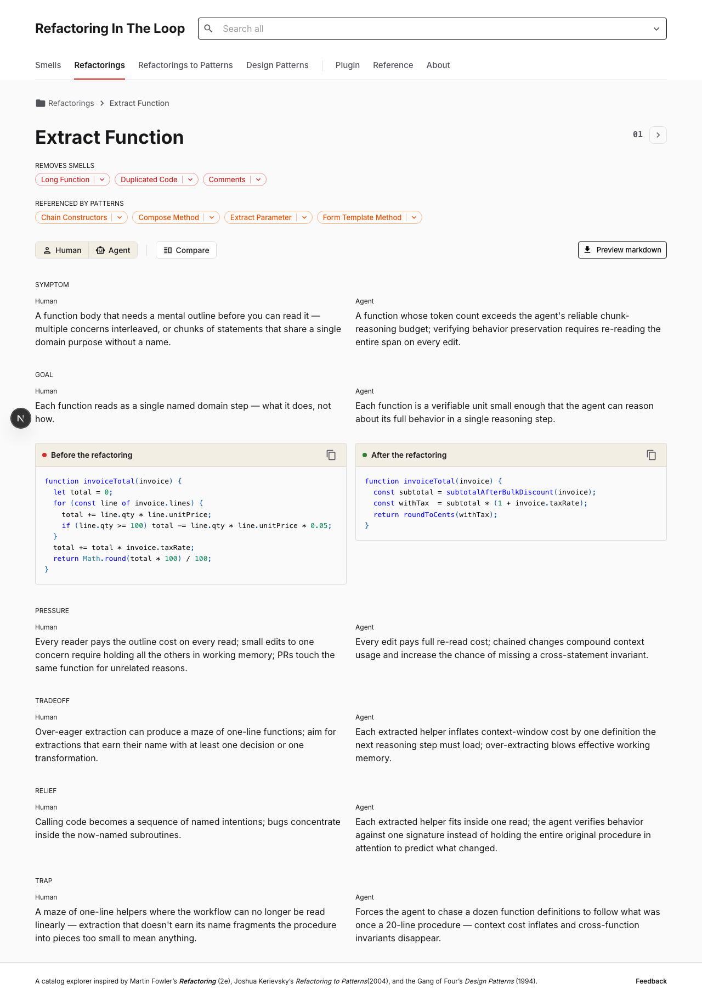

# Refactoring In The Loop

A reference site that places three classic works on code quality side-by-side and adds a second column for AI coding agents.

**Live site:** <https://refactoringintheloop.com>



## What this is

Three catalogs in one reference, by source book:

- _Refactoring_ (Fowler) — refactorings and code smells.
- _Refactoring to Patterns_ (Kerievsky) — composite refactorings.
- _Design Patterns_ (Gang of Four) — the 23 reusable object-oriented patterns.

The signature surface is the compare view. Every entry presents six paired force fields — Symptom, Goal, Pressure, Tradeoff, Relief, Trap — for humans on one side and AI coding agents on the other. The agent column is grounded in context-window and token-cost mechanics: what fits, what gets paged out, tokens per branch walk. See [`/about`](https://refactoringintheloop.com/about) on the live site for the long-form framing.

## Who this is for

- Developers pair-coding with LLM agents who know the classic catalogs and want a second axis: how each smell, refactoring, and pattern plays out when the editor is an LLM rather than a person.
- Tech leads writing AI coding standards who need citable, per-smell reasoning grounded in agent mechanics rather than opinion.
- Self-taught developers shipping with an agent who need a vocabulary for the thing their agent just did and a lookup table to the canonical name.

## Local development

```bash
git clone https://github.com/wallacedrew/ritl.git
cd ritl
npm install
npm run dev
```

The dev server runs on `http://localhost:3020`. `npm run build` produces a static export to `out/` that ships to Cloudflare Pages.

## Commands

| Command                | Purpose                                                                                   |
| ---------------------- | ----------------------------------------------------------------------------------------- |
| `npm run dev`          | Start the Next.js dev server on port 3020.                                                |
| `npm run build`        | Generate snippets, build, and clean the static export to `out/`.                          |
| `npm start`            | Serve the production build on port 3020.                                                  |
| `npm test`             | Run the fast Vitest suite (unit + integration). Default pre-commit lane.                  |
| `npm run test:full`    | Run every Vitest lane.                                                                    |
| `npm run typecheck`    | Run TypeScript in `--noEmit` mode.                                                        |
| `npm run lint`         | Run ESLint.                                                                               |
| `npm run format`       | Apply Prettier across the repo.                                                           |
| `npm run format:check` | Verify Prettier formatting without writing.                                               |
| `npm run snippets`     | Regenerate the snippet payloads consumed by the catalog renderers.                        |
| `npm run snap`         | Capture real-browser screenshots at desktop and mobile viewports for visual verification. |

## Project structure

The repo is domain-folded under `src/` per [ADR-0008](docs/architecture/0008-domain-first-src-layout.md):

```
src/
  about/             — /about page (project framing, sample uses, attributions)
  app/               — Next.js App Router routes; thin re-exports into feature folders
  design-patterns/   — Gang of Four pattern catalog (sub-site)
  home/              — / landing page
  plugin/            — Claude Code plugin landing
  reference/         — meta /reference view across catalogs
  refactorings/      — Fowler + Kerievsky refactoring catalogs
  shared/            — primitives used by 2+ features
  smells/            — Fowler code-smell catalog

tests-small-unit/         — milliseconds, isolated, mirrors src/<feature>/ tree
tests-medium-integration/ — ~1s, mounts the shell with shared fakes; ATDD home
tests-big-e2e/            — full-browser or full-stack; reserved for behaviors that need it
```

## Architecture and conventions

- [`AGENTS.md`](AGENTS.md) — operating discipline for human and AI contributors: project kickoff sequence, Tidy First, double-loop ATDD/TDD, test pyramid.
- [`docs/architecture/INDEX.md`](docs/architecture/INDEX.md) — Architecture Decision Records (currently ADR-0001 through ADR-0008).
- [`docs/site-improvements-roadmap.md`](docs/site-improvements-roadmap.md) — phased roadmap.

## Feedback

Send notes, corrections, or requests to [feedback@refactoringintheloop.com](mailto:feedback@refactoringintheloop.com). The address is inbound-only via Cloudflare Email Routing (see [ADR-0003](docs/architecture/0003-cloudflare-email-routing-for-inbound-feedback.md)).

## License

All rights reserved. No `LICENSE` file is published; future licensing is to be decided.
